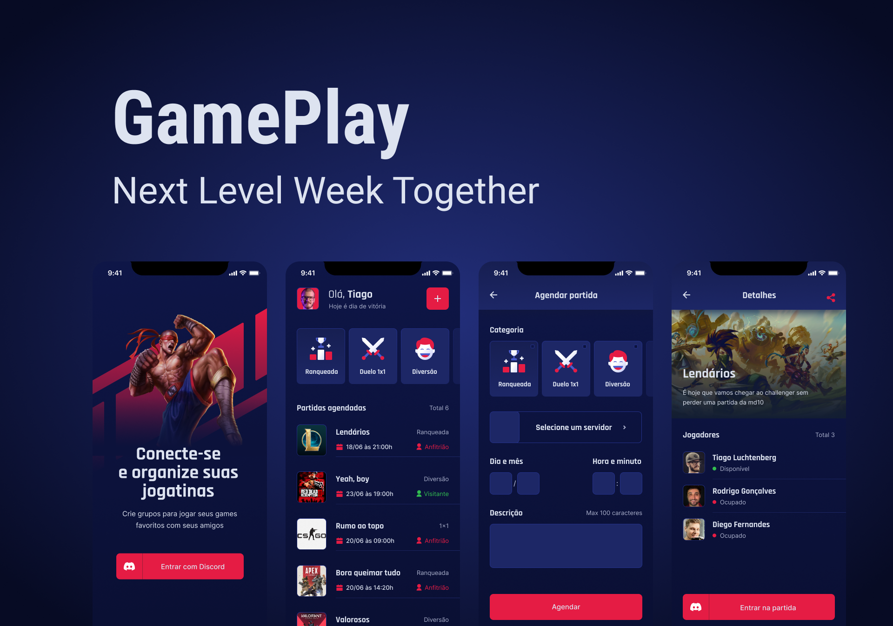
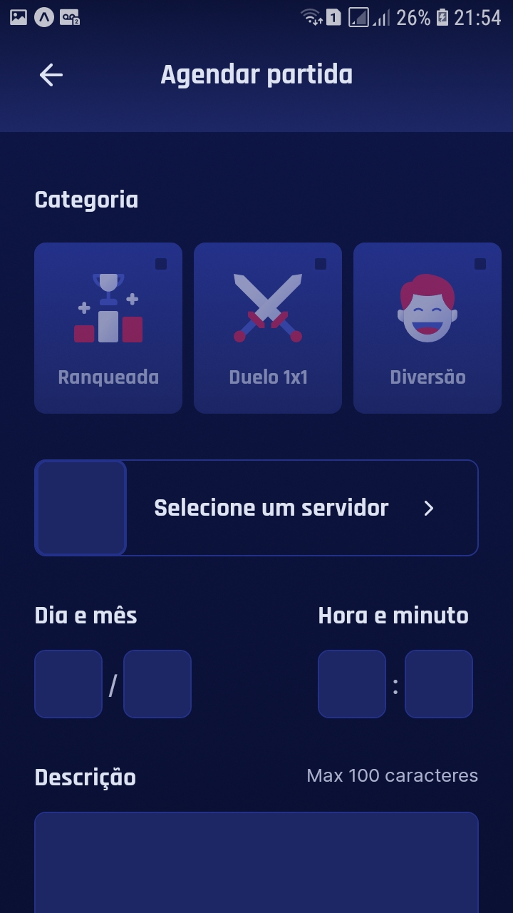
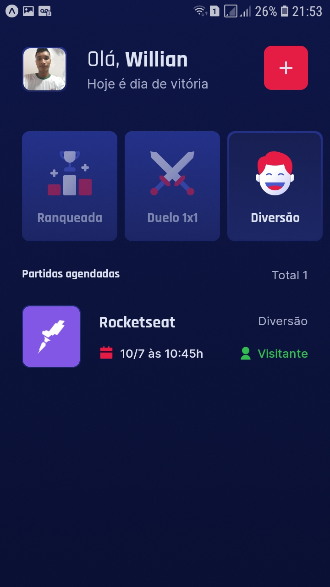
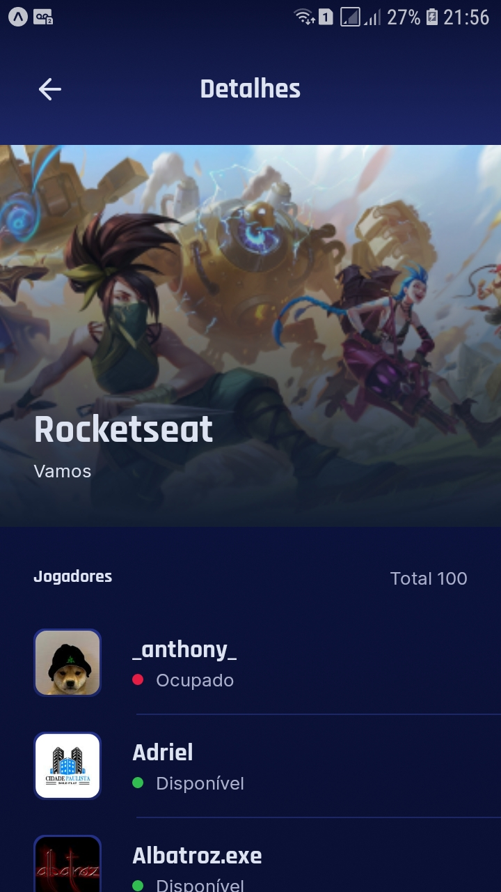
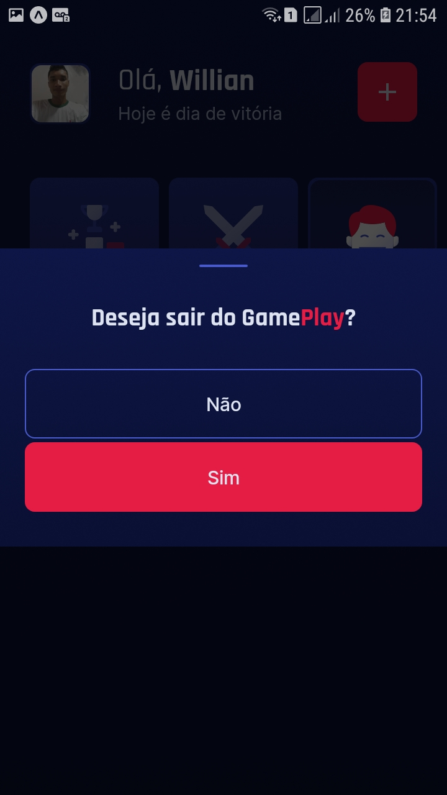

<h1 align="center">
   <br>
</h1>

<br>

<h1 align="center">
  
</h1>

<h1 align="center">
  
  
  
  
  
</h1>

## 💻 Projeto

Aplicação desenvolvida na NLW Together realizado pela [Rocketseat](https://rocketseat.com.br/) na trilha de React Native.<br>

O objetivo desse app é organizar suas jogatinas, sincronzizando-as com o discord.<br>

O login e autenticação foi realizado com Login Social ultilizando o [Discord](https://discord.com/). 

<br>

## 💬 Funcionalidades
```bash
 - Logar com o Discord
 - Agendar partida
 - Mostrar por categoria as partidas agendadas
 - Mostrar as informações da partida e jogadores do servidor onde a partida foi agendada
 - Poderá entrar na partida
 - Caso você seja o anfitrião do servidor, poderá compartilhar o link para entrarem no servidor
 - Deslogar da aplicação clicando na foto do usuário
```
<br>

## ⚙️ Informações de execução

Antes de excutar a aplicação, será preciso criar suas credenciais no [Discord Developer](https://discord.com/developers/applications). <br>
Após criar e gerar o link, renomeie o arquivo ".env.example" para ".env", então adcione as informações necessárias no mesmo. 
<br><br>

## 🎲 Executar aplicação
```bash
# Clone este repositório
$ git clone https://github.com/WillianMedeiros14/gameplay.git

# Entre na pasta do projeto.
$ cd gameplay

# Instale as dependências
$ yarn

# Execute a aplicação
$ expo start
```
<br>

## 🚀 Tecnologias ultilizadas

- Este app foi criado com **[React Native](https://reactnative.dev/)**, utilizando o **[Expo](https://docs.expo.io)**.